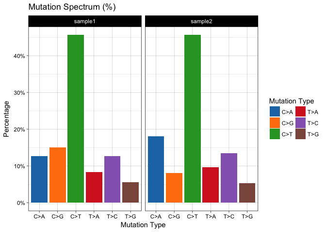
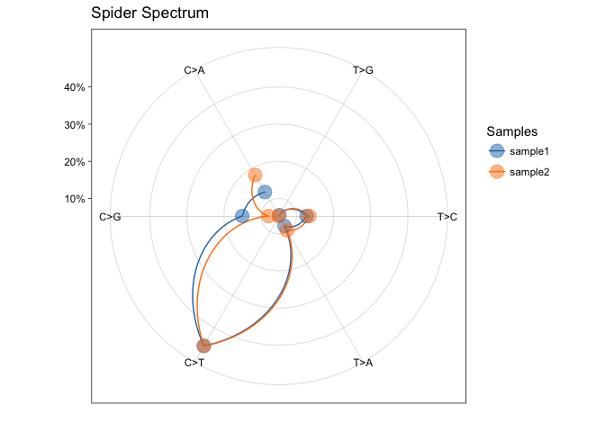
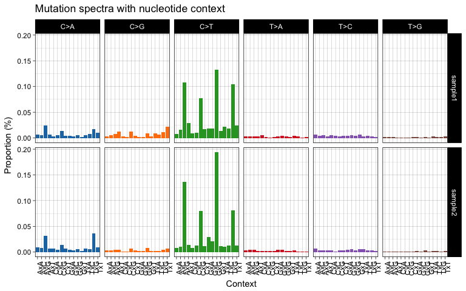
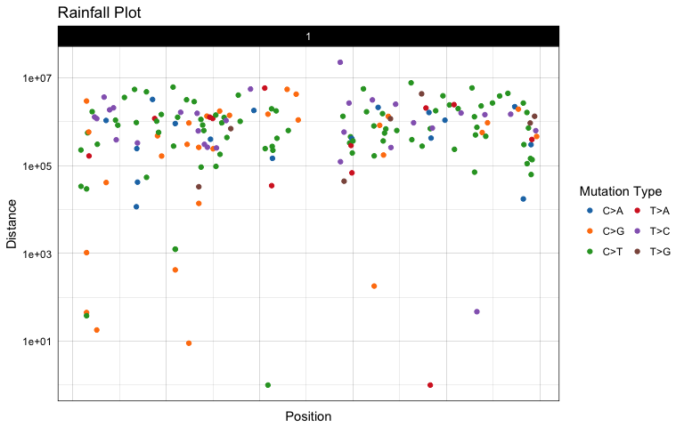

<!-- README.md is generated from README.Rmd. Please edit that file -->
Getting started
===============

Mutcraft is a package of functions to read somatic mutation information from VCF files and visualize spectra, rainplots, strand bias and mutational signatures.

Installation
------------

``` r
library(mutcraft)
```

Reference genome
----------------

In order to extract mutation contexts and mutation strands you need to load a reference genome

``` r
library(BSgenome)
ref_genome = "BSgenome.Hsapiens.NCBI.GRCh37"
library(ref_genome, character.only = T)
```

Load files
----------

``` r
my.files <- list.files(system.file("extdata", package="mutcraft"),
                          pattern = ".vcf", full.names = TRUE)
s.names <- c("sample1", "sample2")
mutnet <- mc.loadVcfs(my.files, s.names, ref.genome=ref_genome)
#> [1] "Loading VCFs files ..."
```

Mutation Spectrum
-----------------

``` r
mutspec <- lapply(mutnet,mc.mutSpectrum,"ref.allele","alt.allele")
mc.plotSpectrum(mutspec,"prop",print.num=F)
```



Spider Spectrum
---------------

``` r
mc.plotSpider(mutspec)
```



Add mutations context
---------------------

``` r
mut.c <- lapply(mutnet, mc.mutContext, ref_genome)
```

Plot context histogram
----------------------

``` r
mc.plotContext(mut.c)
```



Rainfall plots
--------------

``` r
mutrain <- lapply(mutnet, mc.mutRain, "chrom","pos", "ref.allele","alt.allele")
mc.plotRain(mutrain[[1]], chrom.to.plot = c(1))
```


